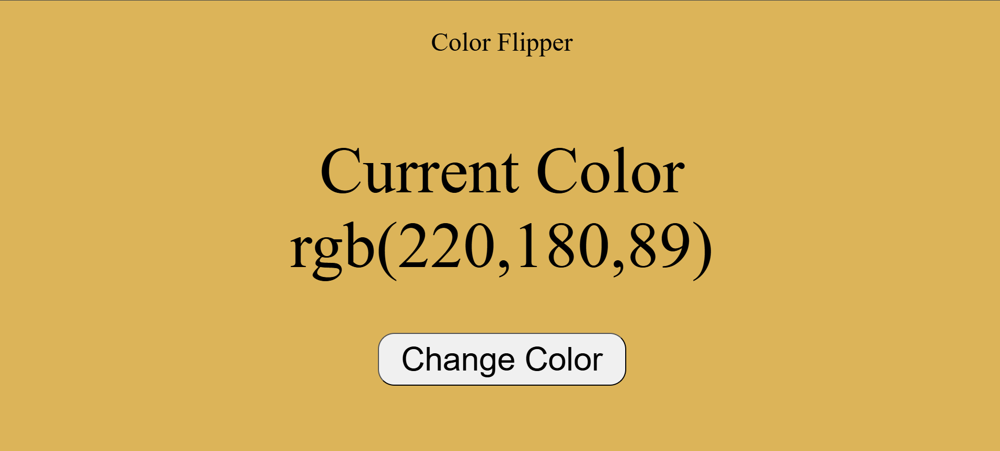

# 🎨 Color Flipper

A simple and interactive Color Flipper built with Vanilla JavaScript.

## ✨ Features

- 🎲 Generates a random RGB background color
- 🖱️ Change color with a single button click
- 🎨 Displays the current RGB color code
- 🌗 Automatically adjusts text color for better readability
- ⚡ Smooth hover and transition effects

## 🛠️ Tech Stack

- HTML5
- CSS3
- JavaScript (Vanilla)

## 📸 Screenshot

## 🚀 How to Run

1. Clone the repository
2. Open `index.html` in your browser

## 📚 What I Learned

- DOM Manipulation
- Event Listeners
- Random Number Generation
- Template Literals
- Dynamic CSS Styling