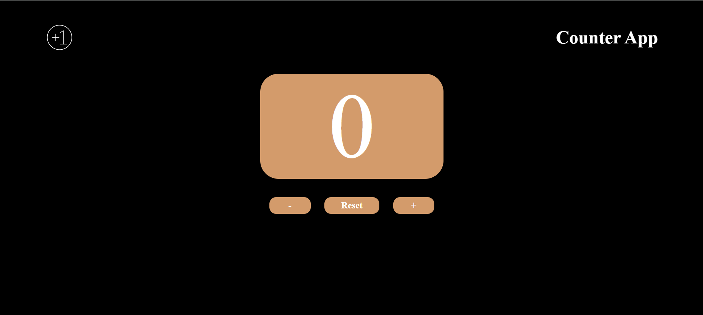

# Counter App 🧮

A simple and interactive counter application built using **HTML**, **CSS**, and **Vanilla JavaScript**.

## ✨ Features

- ➕ Increment counter
- ➖ Decrement counter
- 🔄 Reset counter
- ⌨️ Keyboard shortcuts
  - Arrow Up → Increment
  - Arrow Down → Decrement
  - Space → Reset
- 🎨 Dynamic counter color
  - Positive → Green
  - Negative → Red
  - Zero → White
- 🚫 Counter limit from -100 to 100

## 📸 Screenshot

## 🛠️ Technologies Used

- HTML5
- CSS3
- Vanilla JavaScript