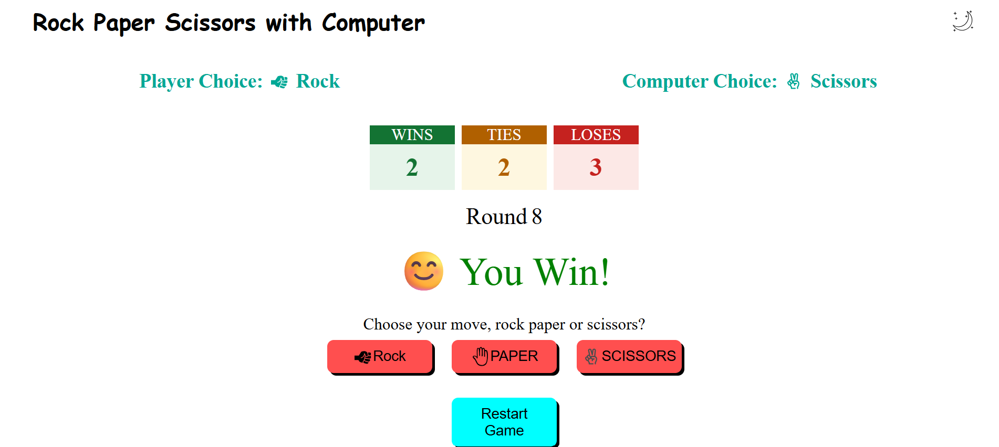

# ✊ Rock Paper Scissors

A fun Rock Paper Scissors game built using **HTML, CSS, and JavaScript**.

## 📸 Screenshot



---

## 🚀 Features

- 🎮 Play against the computer
- 🎲 Random computer moves
- 📊 Live score tracking
- 🔢 Round counter
- 🌙 Light/Dark mode
- 🔄 Restart game
- 🎨 Responsive button hover effects
- ✨ Button animations
- 😀 Win/Lose/Tie reactions

---

## 🛠️ Technologies Used

- HTML5
- CSS3
- JavaScript (Vanilla)

---

## 📂 Folder Structure

```
Rock-Paper-Scissors/
│
├── assets/
│   ├── icons/
│   └── images/
|       └── screenshot.png
│
│
├── index.html
├── style.css
├── script.js
└── README.md
```

---

## 🎮 How to Play

1. Click Rock, Paper, or Scissors.
2. Computer chooses randomly.
3. Winner is calculated automatically.
4. Scores update after every round.
5. Restart anytime using the Restart button.

---

## 📚 What I Learned

- DOM Manipulation
- Event Listeners
- JavaScript Functions
- Random Number Generation
- Conditional Logic
- Theme Switching
- CSS Hover Effects
- CSS Box Shadow
- CSS Animations

---

## 🚀 Future Improvements

- 📱 Responsive Design
- ⌨️ Keyboard Controls
- 💾 Save Score using Local Storage
- 🤖 Smart AI Opponent
- 🔊 Sound Effects

---

Made with ❤️ by Vinayak Pandey